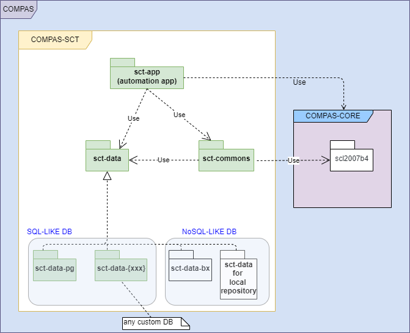

<!-- SPDX-FileCopyrightText: 2021 RTE FRANCE -->
<!-- -->
<!-- SPDX-License-Identifier: Apache-2.0 -->
# COMPAS SCT (Substation Configuration Tool)
## Introduction

The CoMPAS SCT (System Configuration Tool) is part of the CoMPAS (Configuration Module for Power System Automation)
ecosystem which is an open source project aimed at providing a tool for configuring control system and 
profile management related to the 61850 standard. Its architecture allows an easy integration with the other 
components of CoMPAS, in addition to being modular and flexible with a high level of abstraction, it gives 
the freedom to implement the tool with the database of its choice.

The below package diagram shows different part of the tool architecture. 



Hence, we can distinguish four major parts:

* **[sct-commons](#SCT-COMMONS)** : a library that contents shared functionalities for the bound SCL object.
* **[sct-data](#SCT-DATA)** : It holds data models and database connectivity services.
* **[sct-app](#SCT-APPLICATION)** : *TODO*.

## SCT COMMONS
This package holds a light weight and configurable XML binding tool based on the JAXB utilities, and set of bound SCL 
objects adapter. Actually the JAXB generated SCL objects can only be read through from the parent tag to child tag. That can be very limiting.
The adapter concept allows:
* navigating in all direction (upward, downward)
* more flexible manipulation of the JAXB SCL object
* considering specific algorithm based on SCL version

The SCT services specification of the norm IEC 61850  will be implemented in this package.

The Approach behind the SCL adapter is to complete the navigation provided by the JAXB tool, by adding 
functionalities that allow the browsing upward (from child to any ancestor). The conception is based on the 
abstraction defined below :

    public abstract class SclElementAdapter<P extends SclElementAdapter, T> {
        protected P parentAdapter;
        protected T currentElem;
    
        public SclElementAdapter(P parentAdapter) {
            this.parentAdapter = parentAdapter;
        }
    
        public SclElementAdapter(P parentAdapter, T currentElem) {
            this.parentAdapter = parentAdapter;
            setCurrentElem(currentElem);
        }
    
        public final void setCurrentElem(T currentElem){
            Assert.isTrue(amChildElementRef(currentElem),"No relation between SCL parent and child elements");
            this.currentElem = currentElem;
        }
    
        protected abstract boolean amChildElementRef(T sclElement);
    }

The root element adapter (entry point) is special as it does not have any parent adapter, hence, its method `amChildElementRef(T)` 
should always return `true`:

    public class SclRootAdapter extends SclElementAdapter<SclRootAdapter, SCL>{
        private version;
        private revision;
        private release;
    
        public SclRootAdapter(SCL currentElem) {
            super(null, currentElem);
            //set version, release & revision
        }
    
        public SclRootAdapter(String hId, String hVersion, String hRevision){
            super(null);
            this.currentElem = initialize(hId,hVersion,hRevision);
        }
    
        @Override
        protected boolean amChildElementRef(SCL sclElement) {
            return true;
        }

        [...]
    }

## SCT DATA
Data models and connectivity to database are defined here. Data access layer is an abstract layer that defined connectivity
interfaces. This layer manages a database with single table (SQL-Like database) or single collection (NoSQL-Like database).
The concrete data access layers are implemented in specific packages. A data model can implement the following interface

```
public interface IScd <ID> {
    ID getId();
    byte[] getRawXml();
    ID getHeaderId();
    String getHeaderRevision();
    String getHeaderVersion();
    String filename();
}
```

* ### SQL-Like Database
An implementation of the sct-data connectivity interface with custom data models. This allows the application to work with sql-like database.
The libraries ares use for SQL-Like databases, those that support XML type (PostgreSql, Oracle, etc)

* ### NoSQL-Like Database
Like SQL-like part, this package contains the sct-data connector interfaces implementation for NoSQL-Like databases (BaseX, existDB, etc ) 
that support XML processing. 

This can also be a local repository connector (file system). For example, with meta-data headerID, headerVersion, headerRevision and filename
one can implement the connector to have the below output (with the constraint of having a single file in /pathTo/headerId/headerVersion/headerRevision):

```
    myRepo
    ├───<headerID>
    │   ├───<headerVersion1>
    │   │   └───<headerRevision1>
    │   │   |   ├───<fileName1.scd>
    │   │   └───<headerRevision2>
    │   │       ├───<fileName2.scd>
```

## SCT APPLICATION
**TODO**

### Tips for memory consumption's optimization
For large SCL file, it will not be a good idea to load the whole file in memory. JAXB is capable of processing XML file by chunks. 
The need to load the whole SCL file relies on the fact that XML validation processes needs the entire file content.
To go through that processes we  must take advantage on the XSD and build minimal SCL file from the large one.
The most "important" tags in the SCL file : Header, Substation, Communication, IED and DataTypeTemplate. By looking closely in the XSD file, one can realize
the below dependencies' logic :
* IED depends on DataTypeTemplate
* Communication depends on IED (IED name, Access Point)
 
Hence, with this in mind, one can reconstruct a minimal SCL file by focusing on the chunk of interest then realize creation/update operations
on the file and validate it against the XSD file.

For example: Updating IED

From SCD header's information, create a minimal SCD file
```
<SCL version="2007" revision="B" release="4" xmlns="http://www.iec.ch/61850/2003/SCL">
    <Header id="hId" version="2007" revision="B" toolID="COMPAS"/>
</SCL>
```
As IED depends on DataTypeTemplate, extract the IED chunk and the whole DataTypeTemplate chunk
```
<SCL version="2007" revision="B" release="4" xmlns="http://www.iec.ch/61850/2003/SCL">
    <Header id="hId" version="2007" revision="B" toolID="COMPAS"/>
    <IED name="IED_NAME">
      <AccessPoint>....</AccessPoint>
    </IED>
    <DataTypeTemplate>....</DataTypeTemplate>
</SCL>
```
Operations can be realized and validated on this minimal file (Which has the same structure as ICD file).

